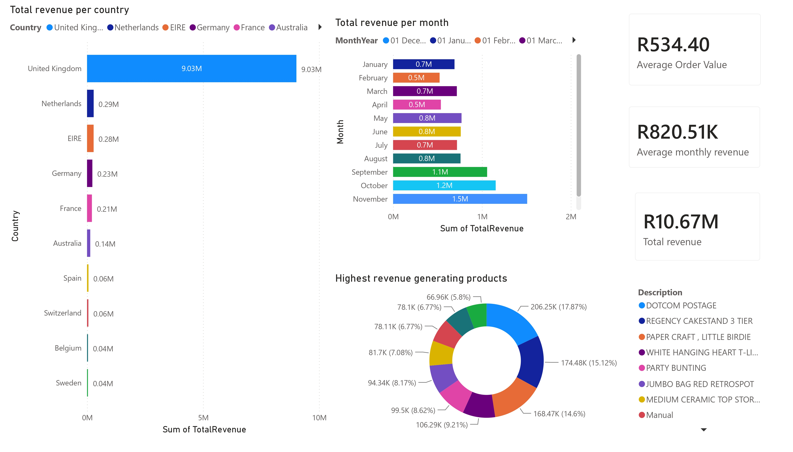

# FUTURE_DS_01

This project loads cleaned retail data, runs revenue analysis, and generates a sales dashboard.

## Project structure

- `data/raw/` - raw source dataset files
- `data/processed/` - generated cleaned data files
- `data/output/` - generated analysis outputs and visualization files

## Run the full workflow

```bash
python data_prep.py
python data_analysis.py
```

## Generated output

Generated files are written to `data/output/`:

- `summary_statistics.csv`
- `revenue_by_month.csv`
- `top_products.csv`
- `revenue_by_country.csv`

## Notes

- `data_prep.py` reads raw source data from `data/raw/data.csv` and writes cleaned data to `data/processed/cleaned_data.csv`.
- `data_analysis.py` reads the cleaned dataset from `data/processed/cleaned_data.csv` and stores reports in `data/output/`.
- A Power BI dashboard summarizing key insights is included below.

## Business Insights



### Key Metrics

| Metric | Value |
|---|---|
| Total Revenue | $10,666,684.54 |
| Best Month | 2011-11 ($1,509,496.33) |
| Worst Month | 2011-02 ($523,631.89) |
| Revenue Trend | Declining — down 22.5% from 2010-12 to 2011-12 |
| Top Product | DOTCOM POSTAGE ($206,248.77 — 1.93% of total) |
| Top Country | United Kingdom ($9,025,222.08 — 84.61% of total) |
| Average Order Value | $534.40 |
| Total Items Sold | 5,588,376 |

### Analysis

Revenue is falling over time, with a **22.5% decline** between December 2010 and December 2011. The business is heavily concentrated in the **United Kingdom** (84.6% of total revenue) and relies on a single top product — **DOTCOM POSTAGE** — which contributes just under 2% of all revenue. No single product dominates sales, and the dataset lacks a category column, so analysis is limited to product-level and country-level breakdowns.

### Actionable Recommendations

- **Focus marketing and inventory** on the top-performing products, especially DOTCOM POSTAGE.
- **Prioritize the United Kingdom market** since it generates 84.6% of total revenue.
- **Prepare promotions or special campaigns** for low-revenue months like February 2011 to smooth out seasonality.
